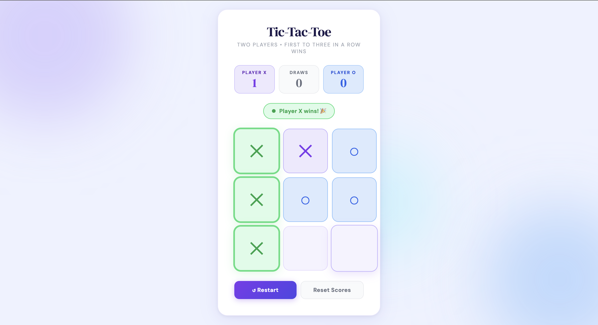

# Tic-Tac-Toe 🎮

A modern, minimal, and fully responsive Tic-Tac-Toe browser game built with pure **HTML**, **CSS**, and **JavaScript** — no frameworks, no dependencies, no build tools.

---
 
## 📁 Project Structure
 
```
tic-tac-toe-master/
│
├── ttt.html      → Game layout and structure
├── TTT.css       → All styles, animations, and responsive design
└── ttt.js        → Game logic, win detection, scoring, and confetti
```
 
---

## 🚀 How to Run
 
1. Download or unzip all three files into the **same folder**
2. Open `ttt.html` in any modern web browser
3. No installation, no build step needed
 
```bash
# Optional: serve locally with Python
python -m http.server 8000
# Then visit: http://localhost:8000/ttt.html
```
 
> **Note:** The game uses Google Fonts (DM Sans + DM Serif Display). An internet connection is needed for fonts to load correctly. The game works offline too — just with a fallback font.
 
---

 ## 🎮 How to Play
 
1. The game is played by **two players** on the same device
2. **Player X** always goes first
3. Players take turns clicking an empty cell to place their mark
4. The first player to get **3 in a row** — horizontally, vertically, or diagonally — wins
5. If all 9 cells fill up with no winner, it's a **draw**
6. Click **↺ Restart** to start a new round (scores are preserved)
7. Click **Reset Scores** to clear all scores and start completely fresh
 
---

## ✨ Features
 
| Feature | Details |
|---|---|
| 🎯 Win detection | Checks all 8 winning combinations after every move |
| 🟢 Winner highlight | The 3 winning cells glow green with a pulsing animation |
| 🎉 Confetti | Colourful canvas confetti bursts on every win |
| 📊 Score tracker | Tracks X wins, O wins, and draws across multiple rounds |
| 🔵 Turn indicator | Live colour-coded chip shows whose turn it is |
| 🤝 Draw detection | Correctly announces a draw when the board is full |
| ✨ Cell animation | Smooth pop-in animation when placing a mark |
| 🌊 Animated background | Three floating blurred orbs (purple, blue, cyan) |
| 📱 Responsive layout | Adapts cleanly for mobile, tablet, and desktop |
 
---

## 🎨 Design Details
 
**Fonts (via Google Fonts)**
- `DM Serif Display` — title heading and cell symbols (✕ and ○)
- `DM Sans` — all body text, labels, and buttons
 
**Color Palette**
 
| Role | Color | Hex |
|---|---|---|
| Player X | Purple | `#7c3aed` |
| Player X light | Lavender | `#ede9fe` |
| Player O | Blue | `#2563eb` |
| Player O light | Sky blue | `#dbeafe` |
| Winner | Green | `#16a34a` |
| Draw | Amber | `#ca8a04` |
| Background | Indigo tint | `#eef2ff` |
| Card surface | White | `#ffffff` |

**Animations**
- `orbFloat` — background orbs slowly float up and down
- `cellPop` — cell scales from 0.4× to 1× with a slight overshoot on click
- `winnerPulse` — winning cells gently pulse their green glow
 
---



---

## 🛠️ Code Overview
 
### `ttt.html`
Semantic HTML5 layout. Contains:
- Three decorative `.bg-orb` divs for the animated background
- A `<canvas id="confetti-canvas">` for the win animation
- Score pills for X, Draws, and O
- A `.turn-chip` div that updates dynamically
- A 3×3 grid of `.cell` divs (indexed `0–8` via `data-index`)
- Two buttons: Restart and Reset Scores
 
### `TTT.css`
All visual styling using CSS custom properties (`:root` variables) for easy customisation. Key sections:
- **Variables** — all colors, shadows, sizes in one place at the top
- **Background orbs** — `position: fixed` blurred circles with `orbFloat` keyframe
- **Score pills** — colored containers for X, O, and Draw counts
- **Turn chip** — pill badge that switches class (`x-chip`, `o-chip`, `win-chip`, `draw-chip`)
- **Board & cells** — CSS Grid layout, hover scale effect, pop animation, winner pulse
- **Buttons** — gradient primary button and outlined ghost button
- **Responsive breakpoints** — `440px` (tablets) and `340px` (small phones)
 
### `ttt.js`
Plain vanilla JavaScript — no libraries. Key functions:
 
| Function | Purpose |
|---|---|
| `updateTurnChip()` | Updates the turn indicator chip for the current player |
| `setChip(type, msg)` | Sets the chip class and text (used for win and draw states too) |
| `getWinningCombo()` | Loops through all 8 win combinations and returns the match or `null` |
| `isBoardFull()` | Returns `true` if all 9 cells are filled |
| `handleCellClick()` | Main game logic — places mark, checks win/draw, switches player |
| `resetBoard()` | Clears the board and resets state; keeps scores intact |
| `resetAll()` | Resets both the board and all scores to zero |
| `launchConfetti()` | Draws animated confetti rectangles on the canvas for 3.5 seconds |
 
---
 
## 📐 Win Combinations
 
All 8 possible winning lines checked after every move:
 
```
Rows:        [0, 1, 2]   [3, 4, 5]   [6, 7, 8]
Columns:     [0, 3, 6]   [1, 4, 7]   [2, 5, 8]
Diagonals:   [0, 4, 8]   [2, 4, 6]
```
 
```
 0 | 1 | 2
-----------
 3 | 4 | 5
-----------
 6 | 7 | 8
```
 
---

 ## 🔧 Customisation
 
All visual tokens are defined as CSS variables at the top of `TTT.css` — edit them to retheme the entire game instantly.
 
**Change player colors:**
```css
:root {
  --x-color: #7c3aed;   /* Player X — purple */
  --o-color: #2563eb;   /* Player O — blue   */
}
```
 
**Change cell size:**
```css
:root {
  --cell-size: 110px;   /* Increase for bigger cells */
}
```
 
**Change card corner radius:**
```css
:root {
  --radius-card: 24px;
  --radius-cell: 16px;
}
```
 
---
## 🌐 Browser Compatibility
 
| Browser | Supported |
|---|---|
| Google Chrome | ✅ |
| Mozilla Firefox | ✅ |
| Microsoft Edge | ✅ |
| Safari (macOS & iOS) | ✅ |
| Mobile Chrome / Firefox | ✅ |
 
Requires support for CSS Grid, CSS custom properties, and `requestAnimationFrame` — all available in every modern browser.

---
 
## 📄 License
 
Free to use, modify, and distribute for personal or educational purposes.
 
---
 
*Built with HTML, CSS & JavaScript — zero dependencies.*
